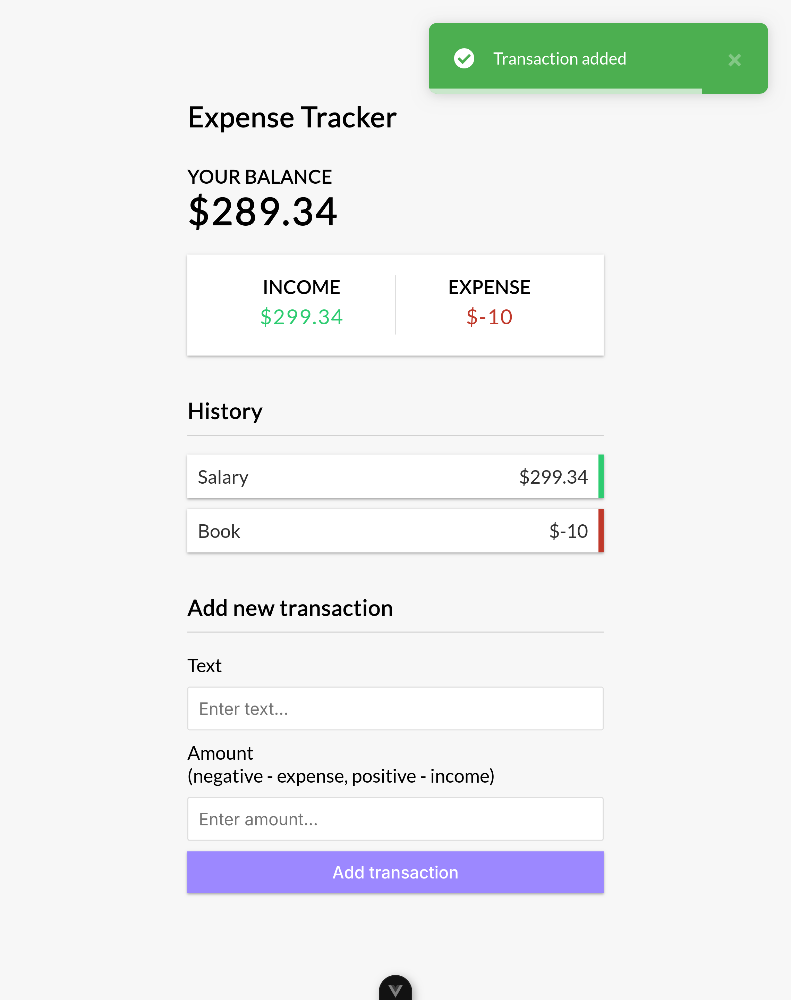

# Expense Tracker App

An expense tracker app built with Vue 3 and the composition API.

- Add and remove expenses/income
- Track balance
- Save data to local storage

## Table of contents

- [Links](#links)
- [Screenshot](#screenshot)
- [Built with](#built-with)

## Links

- Live Site URL: [Netlify](https://my-expense-income-tracker-app.netlify.app/)

## Screenshot

## Built with

- Vue 3 + Composition API
- [Vue Toastification](https://github.com/Maronato/vue-toastification) for notifications
- HTML
- CSS
